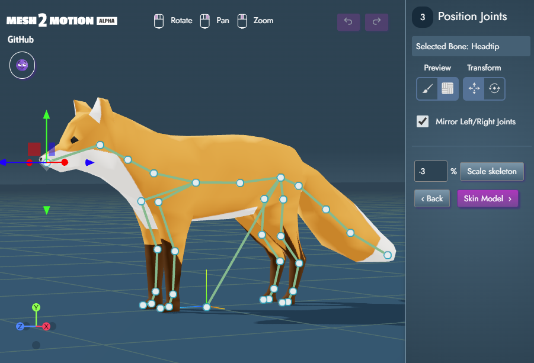

Import a 3D Model and automatically assign and export animations with Mesh2Motion. This is kind of similar to a web application like Mixamo, but I would like it to be more flexible so it can support other model and skeleton types. Hopefully the open source nature means it can be expanded on and evolve more than than the closed tools have. 

The marketing site that explains features and release notes: https://mesh2motion.org/

Try it live: https://app.mesh2motion.org/

## Usage
There are instructions built into the web application, but this is the general flow of how to use it:
1. Import a 3d model of your choosing (currently only supports GLB/GLTF format)
2. Pick what type of skeleton that the 3d model will use
3. Modify the skeleton to fit inside of the model (optionally test the results)
4. Test out various animations to see the results.
5. Select which animations you want to use, then export (currently only GLB/GLTF supported format)

## Building and running
If you want to run this locally or do any improvements, the main dependency you need is Node.js. I am using 18.15, but other versions probably work fine too.Open you command line tool to the directory this readme is in. Run ths following commands to start the web server.

    npm install
    node run dev

## Running and creating video previews
There is separate tool in the web app where you can generate video previews for each animation. It isn't too hard to run, but it has a separate README file that explains how that works. It is more of an internal tool, so I didn't want to muddy up this page too much.

[Preview Generator Documentation](src/preview-generator/README.md)

## Creating a production build for the web
We mostly just have typescript for this project, which web browsers cannot just read, so we need to do a build step to get everything ready for deploying. This project uses Vite for the web server and builder. See the vite.config.js for more info. This command will create a "dist" folder with all the files to serve to the web:

    npm run build

## Contribute to the animation fund
I don't expect to be receiving money for working on this, but I am also not the best animator. If people want to see better and more animations made, add to the fund so I can pay for an animator. Or, if you know an animator that wants to help with this, send them my way! I am just a dude working on this during nights and weekends.

